# canvas-drawer

Implements a simple drawing api

Random circles and stars:

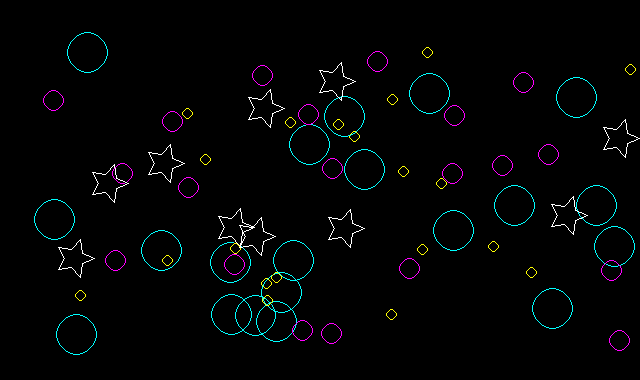

## How to build

*Windows*

Open git bash to the directory containing this repository.

```
canvas-drawer $ mkdir build
canvas-drawer $ cd build
canvas-drawer/build $ cmake -G "Visual Studio 16 2019" ..
canvas-drawer/build $ start Draw-2D.sln
```

Your solution file should contain two projects: `pixmap_art` and `pixmap_test`.
To run from the git bash command shell, 

```
canvas-drawer/build $ ../bin/Debug/draw_test
canvas-drawer/build $ ../bin/Debug/draw_art
```

*macOS*

Open terminal to the directory containing this repository.

```
canvas-drawer $ mkdir build
canvas-drawer $ cd build
canvas-drawer/build $ cmake ..
canvas-drawer/build $ make
```

To run each program from build, you would type

```
canvas-drawer/build $ ../bin/draw_test
canvas-drawer/build $ ../bin/draw_art
```

## Supported primitives
Line drawing, interpolated line colors, triangles, and composite shapes.

More features:
**Circles**
Draw a circle given its center and radius.
```
drawer.background(int r, int g, int, b);
drawer.begin(CIRCLES);
drawer.color(int r, int g, int, b);
drawer.vertex(int y, int x);
drawer.setRadius(int r);
drawer.end();
drawer.save(string filename);
```

**Rectangles**
Draw a rectangle given its center, width, and height.
```
drawer.background(int r, int g, int, b);
drawer.begin(RECTANGLES);
drawer.color(int r, int g, int, b);
drawer.vertex(int y, int x);
drawer.setWidthHeight(int width, int height);
drawer.end();
drawer.save(string filename);
```

**Points**
Draw a point given its coordinate.
```
drawer.background(int r, int g, int, b);
drawer.begin(POINTS);
drawer.color(int r, int g, int, b);
drawer.vertex(int y, int x);
drawer.end();
drawer.save(string filename);
```

**Stars**
Draw a star given its center, outer radius, inner radius, and number of points.
```
drawer.background(int r, int g, int, b);
drawer.begin(STARS);
drawer.color(int r, int g, int, b);
drawer.vertex(int y, int x);
drawer.setRadius(int outer_radius);
drawer.setRadius(int inner_radius);
drawer.arms(int number_of_points);
drawer.end();
drawer.save(string filename);
```

## Results
*Random circles and stars*


*Stars with any number of points given by user input*

drawer.arms(5);

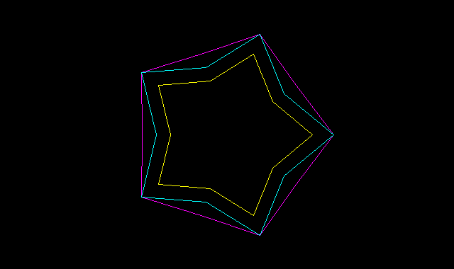

drawer.arms(8);

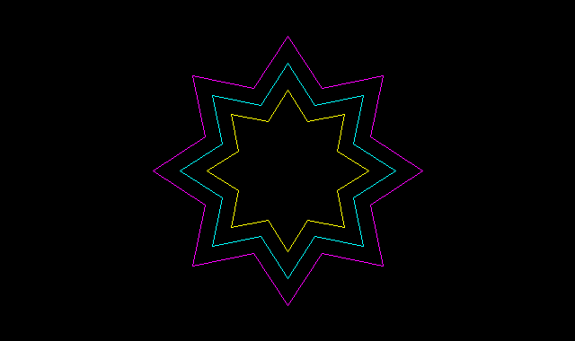

drawer.arms(15);

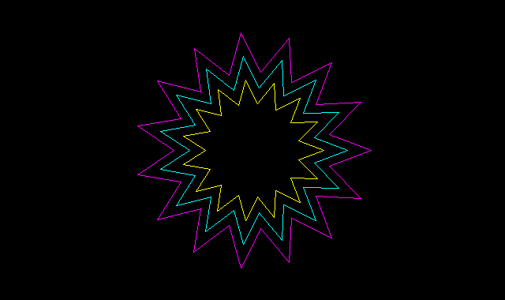

*Circles*

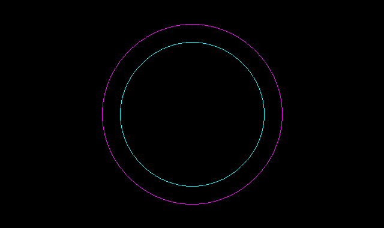

*Rectangles*

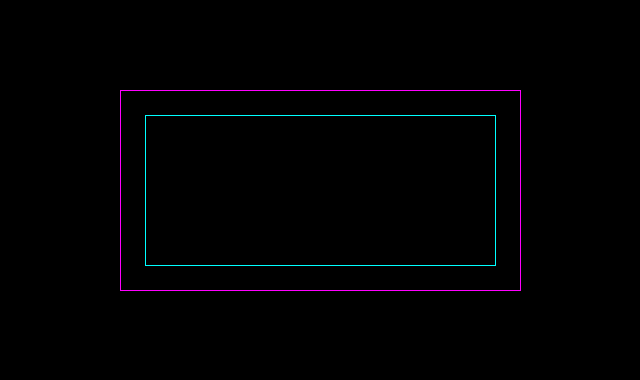

*Default*

*Line drawing*


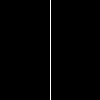
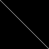
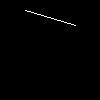

*Interpolated line colors*

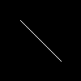
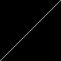
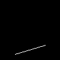
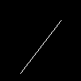

*Triangles and composite shapes*

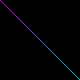

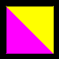
